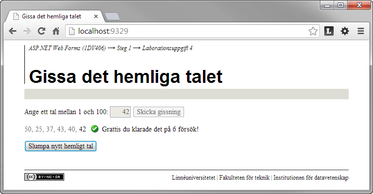

1.4 Gissa det hemliga talet
===========================
[1-4-gissa-det-hemliga-talet.pdf](https://github.com/1dv406/kursmaterial/raw/master/Laborationsuppgifter/1-4-gissa-det-hemliga-talet.pdf)

"Skriv en webbapplikation med hjälp av ASP.NET Web Forms och C# där användaren ska ha sju försök på sig att gissa ett hemligt tal i det slutna intervallet mellan 1 och 100. 

Användaren ska kunna skriva in ett heltal i ett textfält och posta formulärdatat genom att klicka på en kommandoknapp. En historik över gjorda gissningar ska visas. Endast resultatet för den senaste gissningen behöver presenteras. Inga HTML-element ska renderas till klienten i onödan.
"
